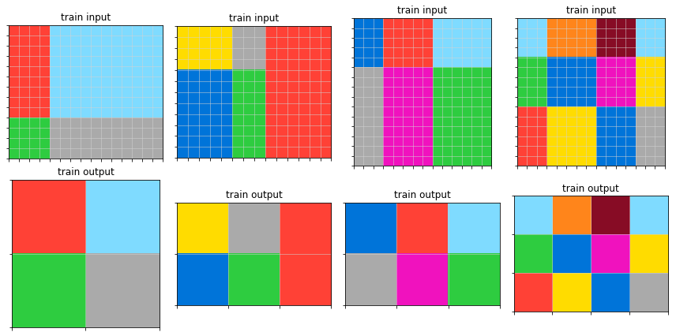
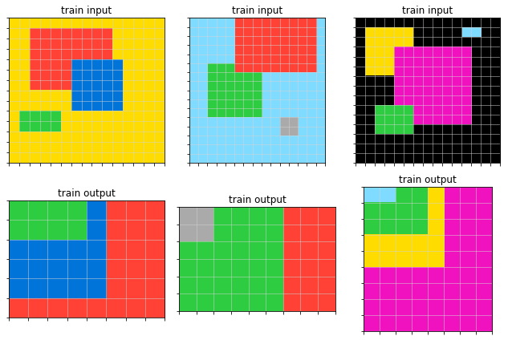
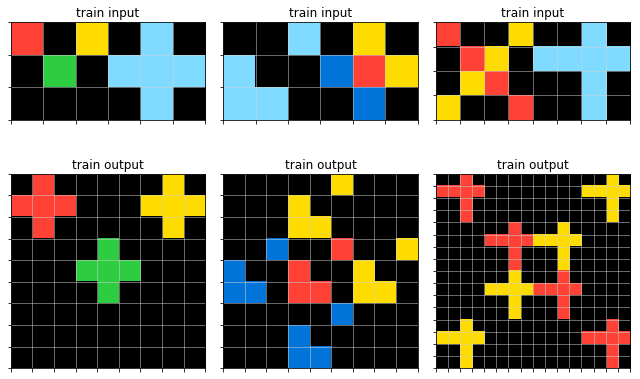
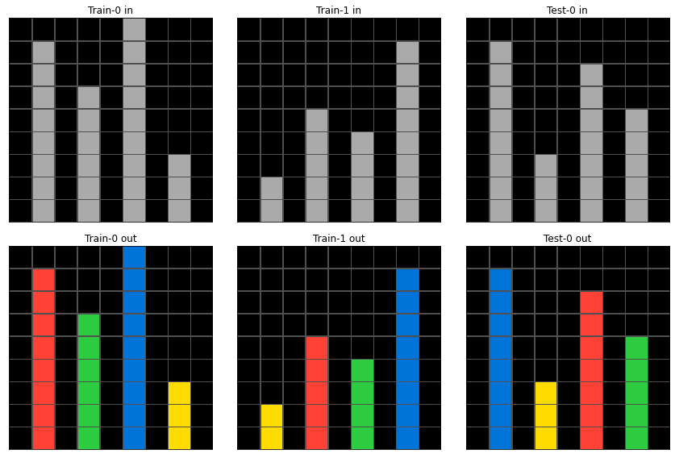

# Kaggle Abstraction and Reasoning Challenge
This is our solution of Kaggle Abstraction and Reasoning Challenge which scored 10th on the leaderboard (there were 915 competitors).

## The challenge
The Abstraction and Reasoning Corpus is hosted here: https://github.com/fchollet/ARC. It offers 400 tasks in the train dataset, 
400 tasks in the validation set, and 100 tasks in the test set (hidden). Every task is a little similar to some tasks from IQ test.
An example of a task:<br>


So, every task is a little puzzle. There are 2 to 4 images in the "train" set, and 1-2 "test" images, 
for which we have to provide an answer. There is some mapping between inputs and outputs, which our program has to guess. 
For example, the task above is obviously about changing the color of any nested figure to the color of its surrounding. 
Oh, by the way, output image shape might differ from the input's shape, we must guess it too! 
All image dimensions are not greater than 30x30.

The task is solved if and only if all predicted image pixels are correct and predicted image shape is correct. More examples below.

Draw horizontal and vertical lines:<br>


Reshape figures, use all unique colors:<br>


Count the most frequent color at the top, put it to the bottom:<br>


Move shapes with overlap:<br>


Replicate figure on the right with colors and locations on the left:<br>


## How would you solve this?

Before reading below, take a minute and think if you can write a program to solve tasks like these. 
Keep in mind that such program is expected to solve new, unseen tasks of a similar nature, but not necessarily of one of aforementioned types.
Humans solve tasks like these easily. Tasks could involve something like moving pieces, sorting by some criterio, painting pixels,
projecting, using symmetry and so on.
<br><br><br><br><br><br><br>


## Our approach

We have build a Genetic Algorithm on top of Cellular Automata and global transformations. 
We created a Domain-Specific Language (DSL) which describes possible programs to solve such tasks. 
It has simple operations like move, paint, check neighbours and so on.

### Cellular Automata

Cellular Automaton (think Conway's Game of Life) is a set of rules which are repeatedly applied per-pixel to the input image 
until convergence is reached. Rules are something like: check neighbours and paint pixel or paint pixels in some direction.

### Global rules

Global rules are more interesting. They are:
* tile the input;
* flip or rotate;
* draw pixels, starting from the border;
* fill;
* remove rows;
* draw lines;
* split image;
* crop figure or crop non-background pixels;
* make holes;
* move pieces;
* and most importantly, replace colors (this allows everything else work together).

### Genetic Algorithm

The number of possible combinations is combinatorial (read: huge). 
To iterate over its space efficiently, we use genetic algorithm.
In a few words, this means that we start with a population of random program, than we pick most promising ones and 
mutate and/or crossover them. This is called asexual and sexual reproduction, correspondingly.

### Add more tricks

We introduced split and merge rules. This means that we can split image into several buffers, every figure is in its own buffer,
and apply transformations to every buffer independently. This greatly improves leaderboard score.

## Results
As a result, the algorithm solves even more complex tasks (which it wasn't supposed to solve originally). 
This task implies sorting bars by height and recoloring them:


## Building and running
From the root directory of this repo, do this:

```
pip install .
cd python-dsl-code
python genetics.py
```

## Technical details
Initially, everything was implemented in Python. After we teamed up, we identified Python code as a bottleneck 
and ported all rules to C++. This improved performance by a factor 50 to 100, so it allowed us to solve more complex tasks 
withing same time constraints.

We use pybind11 to build Python extension module.

## More information
You're welcome to read this forum thread, you can ask us some questions over there: https://www.kaggle.com/c/abstraction-and-reasoning-challenge/discussion/154294

You can also play with this notebook which has Python version of our code: https://www.kaggle.com/alexfritz/genetic-dsl-part-from-10th-place-python-version
